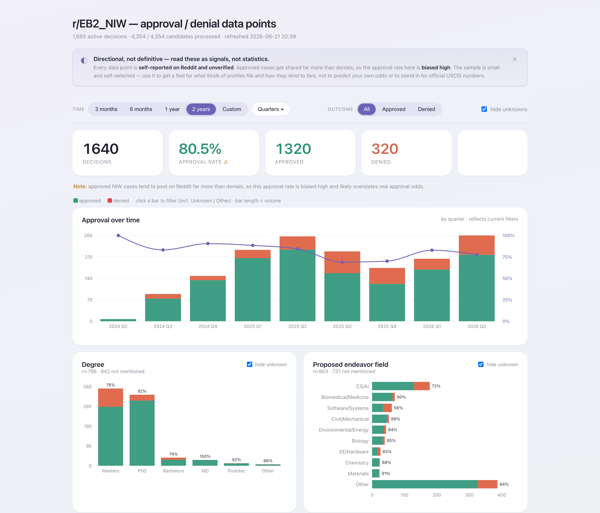

# NIW Stats — Reddit r/EB2_NIW approval & denial data

A simple dashboard of self-reported **EB-2 NIW (I-140 National Interest Waiver)** approvals and
denials shared on [r/EB2_NIW](https://www.reddit.com/r/EB2_NIW/) — so you can see what kinds of
profiles file, and how they tend to fare.

### 🔗 [Open the live dashboard »](https://shawnzxiang.github.io/niw-stats-from-reddit-dashboard/)

⭐ **Found this useful? Please star the repo** — it helps others in the immigration community find it.

> ⚠️ **Read these as signals, not statistics.** Every data point is self-reported on Reddit and
> unverified. Approved cases get shared far more than denials, so the approval rate shown is biased
> high. Use it to get a feel for the landscape — not to predict your own odds, and not as a stand-in
> for official USCIS numbers.

## What you can explore

Approval and denial trends over time, broken down by:

- **Degree** (PhD, Masters, …) and **proposed endeavor field** (CS/AI, biomedical, …)
- **Profession** and **law firm** (including DIY / self-petition)
- **Publications, citations, patents, years of experience**
- **Processing time**, **premium vs regular** processing, and **RFE rate**
- **Re-files** — denied cases by someone later approved

Filter by time range and outcome; every chart updates together.

## Where the data comes from

Public posts on r/EB2_NIW are collected, and an LLM reads each post — title, body, and the author's
own follow-up comments — to pull out the structured fields above. Only posts reporting a **final
I-140 NIW approval or denial** are counted; questions, RFE-without-outcome, and I-485 posts are
filtered out.

**Privacy:** the published dataset is scrubbed — it contains the aggregate charts and per-post
structured fields, but **no usernames, post text, or comments**. Each row simply links back to the
original public Reddit thread.

## License

Free for non-commercial use under the [PolyForm Noncommercial License 1.0.0](LICENSE.md).

Built by Shawn Xiang. Not affiliated with USCIS or Reddit, and not legal advice.
